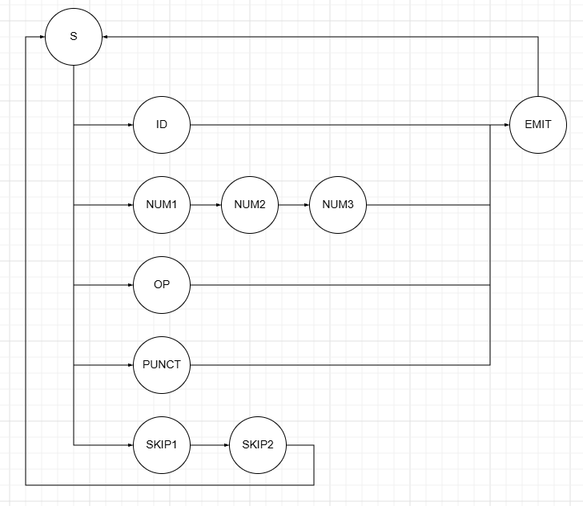
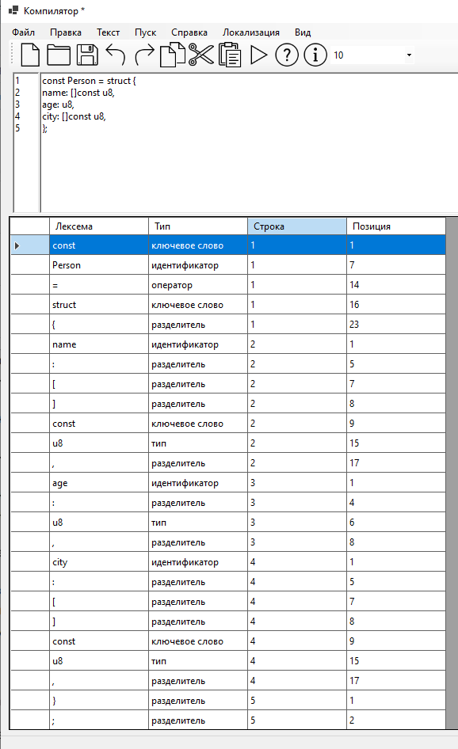
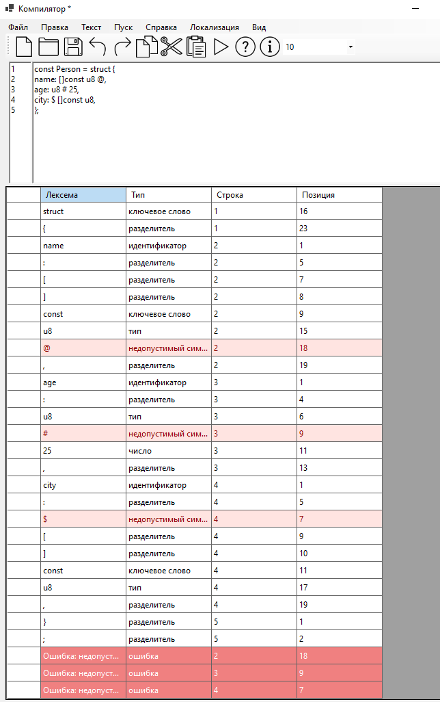
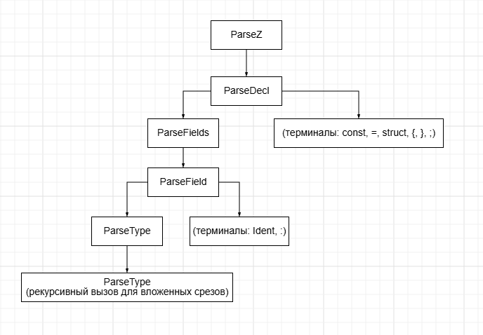
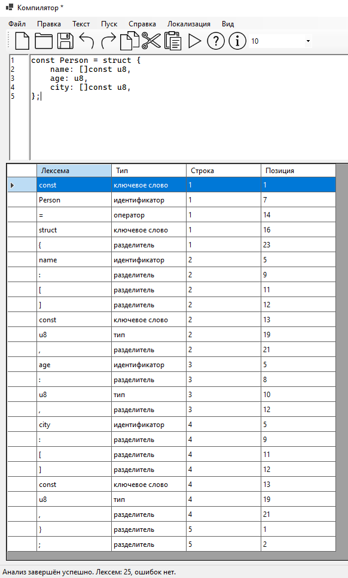
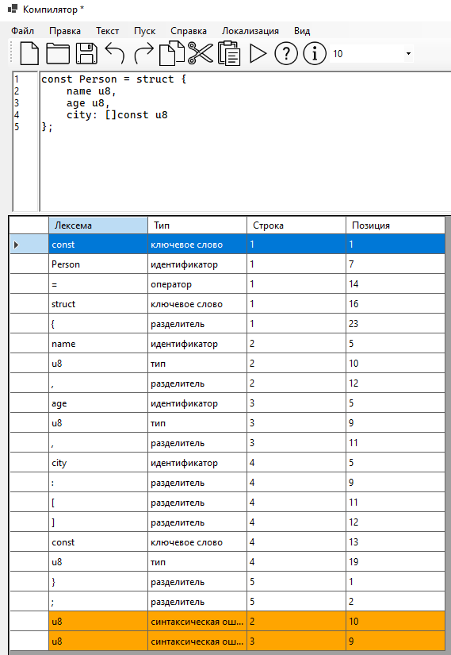

# Лабораторная работа 1: GUI

### Цель работы: 
Создание пользовательского интерфейса

### Цель работы: 
Создание пользовательского интерфейса

### Автор: 
Кузьмин Илья, группа АП-326

### Описание проекта:

Оконное приложение:
1. Основное меню программы.
2. Панель инструментов с кнопками быстрого доступа.
3. Область ввода и редактирования текста.
4. Область вывода результатов работы языкового процессора.

Приложение поддерживает создание, открытие, сохранение документов, стандартные операции редактирования текста, вызов справки, окно "О программе", переключение языка интерфейса (русский/английский), изменение размера шрифта, нумерацию строк и перетаскивание файлов в окно редактора.

Используемые технологии:
Язык программирования: C#
Фреймворк для GUI: Windows Forms (.NET 8.0)
Среда разработки: Visual Studio 2022
Платформа: Windows

Инструкция по сборке и запуску

Установка зависимостей
1. Установить .NET SDK 8.0 с официального сайта Microsoft.
2. Дополнительных библиотек не требуется — используются только стандартные средства .NET и Windows Forms.

### Путь к готовому исполняемому файлу

    bin/Debug/net8.0-windows/TeorKomp_Lab1.exe

Или

    bin/Release/net8.0-windows/win-x64/publish/TeorKomp_Lab1.exe

### Описание интерфейса и функций (руководство пользователя): скриншоты работы программы и интерфейса с пояснением ключевых элементов с подробным указанием, как они вызываются (меню, кнопка, горячая клавиша) и что делают.

Главное окно содержит:

- Строку основного меню (сверху).
- Панель инструментов с кнопками быстрого доступа (под меню).
- Область ввода и редактирования текста с нумерацией строк (в центре).
- Область вывода результатов в виде таблицы (внизу).
- Строку состояния (в самом низу).

Меню "Файл"

- Создать (Ctrl+N) — создаёт новый пустой документ. Если текущий документ был изменён, предлагается сохранить его.
- Открыть (Ctrl+O) — открывает диалог выбора текстового файла.
- Сохранить (Ctrl+S) — сохраняет текущий документ. Если файл не имеет имени, открывается диалог "Сохранить как".
- Сохранить как (Ctrl+Shift+S) — сохраняет документ под новым именем.
- Выход (Ctrl+Q) — закрывает приложение. При наличии несохранённых изменений запрашивается подтверждение.

Меню "Правка"

- Отменить (Ctrl+Z) — отменяет последнее действие.
- Повторить (Ctrl+Y) — повторяет отменённое действие.
- Вырезать (Ctrl+X) — вырезает выделенный фрагмент в буфер обмена.
- Копировать (Ctrl+C) — копирует выделенный фрагмент в буфер обмена.
- Вставить (Ctrl+V) — вставляет содержимое буфера обмена.
- Удалить (Delete) — удаляет выделенный фрагмент. Если выделения нет — удаляет символ справа от курсора.
- Выделить всё (Ctrl+A) — выделяет весь текст в редакторе.

Меню "Пуск"

- Пуск (F5) — запускает анализ исходного кода. На данном этапе выводится информационное сообщение; полноценный анализ будет добавлен в следующих лабораторных работах.

Меню "Справка"

- Вызов справки (F1) — открывает окно с описанием реализованных функций.
- О программе — выводит информацию о названии и версии приложения.

Меню "Локализация"

- Русский — переключает интерфейс на русский язык.
- English — переключает интерфейс на английский язык.

Меню "Текст"

Содержит пункты для перехода к разделам документации языкового процессора (постановка задачи, грамматика, классификация грамматики, метод анализа, тестовый пример, список литературы, исходный код программы). Функционал будет реализован в следующих лабораторных работах.

Панель инструментов

Содержит кнопки быстрого доступа ко всем основным функциям меню "Файл", "Правка" и "Справка", а также выбор размера шрифта:

- Создать, Открыть, Сохранить.
- Отменить, Повторить, Копировать, Вырезать, Вставить.
- Пуск, Справка, О программе.
- Выбор шрифта.

Область ввода и редактирования текста:
Основное поле для ввода и редактирования исходного кода. Слева отображается нумерация строк, синхронизированная с прокруткой. Поддерживается перетаскивание файлов (Drag & Drop) в окно редактора — при перетаскивании текстового файла он автоматически открывается.

Область вывода результатов:
Таблица в нижней части окна предназначена для отображения результатов работы языкового процессора (лексемы, типы, позиции).

Горячие клавиши:

    Ctrl+N — создать
    Ctrl+O — открыть
    Ctrl+S — сохранить
    Ctrl+Shift+S — сохранить как
    Ctrl+Q — выход
    Ctrl+Z — отменить
    Ctrl+Y — повторить
    Ctrl+X — вырезать
    Ctrl+C — копировать
    Ctrl+V — вставить
    Ctrl+A — выделить всё
    Delete — удалить
    F5 — пуск
    F1 — справка

### Ограничения:

1. Область вывода результатов на данный момент не заполняется — языковой процессор будет реализован в следующих лабораторных работах.
2. Пункт меню "Пуск" выводит только информационное сообщение.
3. Разделы меню "Текст" (постановка задачи, грамматика, классификация грамматики, метод анализа, тестовый пример, список литературы, исходный код программы) пока не реализованы.
4. Переключение языка не влияет на уже открытое окно справки — при смене языка справку нужно открыть заново.
5. Нумерация строк обновляется при изменении текста, прокрутке и смене шрифта, но не синхронизируется с горизонтальной прокруткой.
6. Поддерживается открытие только текстовых файлов (расширения .txt, .cs, .cpp, .h, .json и файлы без расширения) через механизм Drag & Drop.
7. Приложение собрано под Windows и использует Windows Forms; запуск на других платформах без эмуляции невозможен.
---
# Лабораторная работа 2: Разработка лексического анализатора (сканера)
=======

# Лабораторная работа 2: Разработка лексического анализатора (сканера)

### Цель работы: 
Изучить назначение и принципы работы лексического анализатора в структуре компилятора. Спроектировать алгоритм (диаграмму состояний) и выполнить программную реализацию сканера для выделения лексем из входного текста. Интегрировать разработанный модуль в ранее созданный графический интерфейс языкового процессора.

### Постановка задачи:
Разработать лексический анализатор (сканер) в соответствии с индивидуальным вариантом задания, интегрировать его в приложение из лабораторной работы №1 и обеспечить наглядный вывод результатов.

### Вариант задания: 
Объявление структуры на языке Zig.

**Примеры корректных входных строк:** 
const Person = struct {
name: []const u8,
age: u8,
city: []const u8,ф
};

const Point = struct {
x: i32,
y: i32,
};

const Config = struct {
host: []const u8,
port: u16,
enabled: bool,
};

**Перечень допустимых лексем:**

- Ключевые слова: `const`, `var`, `struct`, `enum`, `union`, `fn`, `pub`, `return`, `if`, `else`, `while`, `for`, `break`, `continue`.
- Встроенные типы: `u8`, `u16`, `u32`, `u64`, `i8`, `i16`, `i32`, `i64`, `f16`, `f32`, `f64`, `bool`, `void`, `usize`, `isize`.
- Идентификаторы: последовательности латинских букв, цифр и `_`, начинающиеся с буквы или `_`.
- Числа: целые (`123`) и вещественные (`3.14`).
- Операторы: `+`, `-`, `*`, `/`, `%`, `=`, `<`, `>`, `!`, `&`, `|`, `^`, `~`, `?`, а также двухсимвольные: `==`, `!=`, `<=`, `>=`, `=>`, `->`, `<<`, `>>`, `++`, `--`.
- Разделители:`{`, `}`, `(`, `)`, `[`, `]`, `,`, `;`, `:`, `.`.
- Комментарии: однострочные `// ...` (пропускаются).

Все остальные символы считаются недопустимыми и выводятся как ошибки с указанием строки и позиции.

- S (начальное состояние) — пропускает пробельные символы, определяет тип лексемы по первому символу и передаёт управление соответствующему состоянию.
- ID — читает последовательность латинских букв, цифр и `_`. По завершении проверяет, является ли полученное слово ключевым, встроенным типом или идентификатором.
- NUM — читает целую часть числа, при наличии `.` — дробную часть.
- PUNCT — одиночный знак пунктуации.
- OP — оператор (возможно двухсимвольный, например `==` или `->`).
- SKIP — пропускает пробелы, табуляции, переводы строк и однострочные комментарии.
- EMIT — добавляет готовую лексему в результирующий список и возвращает управление в S.

буква (A–Z, a–z) или _	         ID
цифра (0–9)	                     NUM
+ - * / % = < > ! & | ^ ~ ?	     OP
{ } ( ) [ ] , ; : .	             PUNCT
пробел, \t, \n, \r	             SKIP
/ + /	                         SKIP (пропустить до конца строки)
всё остальное	                 ERROR (или сразу EMIT с типом Unknown)

**Внутренние переходы:**
ID → ID: пока символ — буква, цифра или _.
NUM → NUM: пока символ — цифра.
NUM → NUM: если символ . и следующий — цифра.
ID → EMIT: как только символ не подходит.
NUM → EMIT: как только символ не цифра.
OP → EMIT: сразу (1 или 2 символа).
PUNCT → EMIT: сразу (1 символ).
SKIP → SKIP: пока пробел или \n.
SKIP → S: как только встретился непробельный символ.
EMIT → S: всегда.

### Тестовые примеры: 
1)
const Person = struct {
name: []const u8,
age: u8,
city: []const u8,
};

2)
const Person = struct {
name: []const u8 @,
age: u8 # 25,
city: $ []const u8,
};

# Лабораторная работа 3. Разработка синтаксического анализатора (парсера)
### Цель работы:
Изучить назначение и принципы работы синтаксического анализатора в структуре компилятора. Спроектировать грамматику, построить соответствующую схему метода анализа грамматики и выполнить программную реализацию парсера с нейтрализацией синтаксических ошибок методом Айронса. Интегрировать разработанный модуль в ранее созданный графический интерфейс языкового процессора.

### Постановка задачи
Разработать синтаксический анализатор (парсер) в соответствии с индивидуальным вариантом курсовой (расчётно-графической) работы, интегрировать его в приложение из лабораторной работы №1 и обеспечить наглядный вывод результатов анализа.

Требования к разработке парсера:

разработать грамматику для заданной синтаксической конструкции;
построить схему метода анализа на основе разработанной грамматики;
выполнить программную реализацию алгоритма работы синтаксического анализа;
реализовать алгоритм нейтрализации синтаксических ошибок методом Айронса.

Входные данные — строка (текст программного кода) из области редактирования. Выходные данные: при успешном анализе — сообщение об отсутствии ошибок; при обнаружении ошибок — таблица с описанием каждой ошибки.

### Вариант задания:
15. объявление структуры на языке Zig.

Примеры корректных входных строк:
1)
const Person = struct {
    name: []const u8,
    age: u8,
    city: []const u8,
};
2)
const Point = struct {
    x: i32,
    y: i32,
};
3)
const Config = struct {
    host: []const u8,
    port: u16,
    enabled: bool,
};

### Разработка грамматики
Для описания синтаксической конструкции «объявление структуры на языке Zig» разработана следующая грамматика G[Z]:

Z        → Decl
         | Z Decl

Decl     → 'const' Ident '=' 'struct' '{' Fields '}' ';'
         | 'const' Ident '=' 'struct' '{' '}' ';'

Fields   → Field
         | Fields ',' Field
         | Fields ','

Field    → Ident ':' Type

Type     → '[' ']' 'const' Type
         | Ident

Обозначения:

Z — начальный символ (программа из одного и более объявлений структур);
Decl — одно объявление структуры;
Fields — список полей, разделённых запятыми; допускается запятая перед закрывающей фигурной скобкой;
Field — одно поле вида имя : тип;
Type — либо срез []const <Type>, либо идентификатор (встроенный тип или пользовательский);
Ident — идентификатор (в позиции имени допускаются также ключевые слова и встроенные типы, кроме зарезервированных const и struct).

Грамматика допускает:

пустую структуру struct {} — правило с пустым списком полей;
несколько объявлений подряд — правило Z → Z Decl;
запятую перед } — правило Fields → Fields ',';
вложенные срезы, например []const []const u8.

### Классификация грамматики по Хомскому
Разработанная грамматика относится к контекстно-свободным грамматикам (тип 2 по классификации Хомского).

Обоснование:

в каждой продукции слева стоит ровно один нетерминальный символ;
правая часть содержит произвольную цепочку из терминалов и нетерминалов;
ни одно правило не имеет вида αAβ → αγβ с непустым контекстом (это было бы контекстно-зависимой грамматикой, тип 1);
ни одно правило не содержит двух и более нетерминалов в левой части (это было бы грамматикой типа 0);
грамматика не является автоматной (тип 3), так как в правилах для Decl, Fields, Field, Type правая часть содержит больше одного символа и присутствует вложенность — значит, это строго контекстно-свободная грамматика.

### Метод анализа
Для разбора выбран метод рекурсивного спуска (LL(1)-подобный). Для каждого нетерминала реализована отдельная процедура, которая:

проверяет текущий токен;
при совпадении переходит к следующему;
при несовпадении фиксирует ошибку и передаёт управление механизму синхронизации.

Схема метода анализа:

Если текущий токен совпадает с ожидаемым значением — переходим к следующему, иначе — фиксируем ошибку с указанием позиции и не двигаемся дальше (синхронизацию выполняет внешний уровень). Кнопка «Пуск» запускает сначала лексический анализатор, затем — синтаксический. Если на лексическом этапе обнаружены ошибки, синтаксический анализ не выполняется, поскольку токенизация некорректна.

### Диагностика и нейтрализация синтаксических ошибок
Для нейтрализации ошибок применён метод Айронса. Идея метода: при обнаружении ошибки анализ не прекращается — выполняется пропуск токенов до ближайшего синхронизирующего токена из множества follow текущего нетерминала. После синхронизации разбор продолжается с того места, где встретился синхронизирующий токен.

Множества синхронизирующих токенов для нетерминалов грамматики:

Нетерминал	Синхронизирующие токены
Z	const, конец файла
Decl	const, ;, конец файла
Fields	,, }, ;, конец файла
Field	,, }, ;, конец файла
Type	,, }, ;, конец файла
Алгоритм:

При несовпадении текущего токена с ожидаемым фиксируется ошибка с указанием фрагмента, строки и позиции.
Вызывается процедура синхронизации SkipTo<Sync>, которая пропускает токены до ближайшего синхронизирующего.
Разбор продолжается с этого токена.

Такая стратегия позволяет обнаружить несколько ошибок за один проход и не останавливаться на первой. Все ошибки собираются в список и выводятся в таблицу результатов. Ошибочные строки в таблице подсвечиваются оранжевым цветом. При клике по строке с ошибкой курсор в области редактирования перемещается к позиции ошибочного фрагмента.

Пример работы метода Айронса для строки:

const Person = struct { name u8, age: u8, };

Обнаруживаются две ошибки:
пропущен символ : после имени name;
пропущен символ , между полями name u8 и age: u8.

Разбор не останавливается после первой ошибки — обе фиксируются за один проход.

### Тестовые примеры
Пример 1. Корректная строка
Вход:

const Person = struct {
    name: []const u8,
    age: u8,
    city: []const u8,
};

Пример 3. Строка с несколькими синтаксическими ошибками

const Person = struct {
    name u8,
    age u8,
    city: []const u8
};

Ошибки:
пропущен : после имени name;
пропущен : после имени age;

